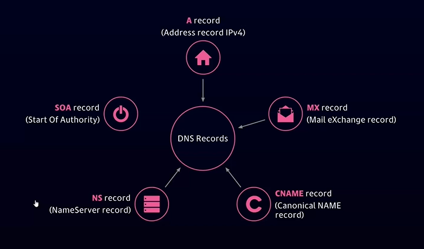

# 1 Footprinting

## Website Footprinting

### HTTrack

mirror websites. More at [https://en.kali.tools/?p=443](https://en.kali.tools/?p=443)

Install on debian unix like kali:

```
$ apt-get install httrack webhttrack
$ webhttrack
```

Use the webhttrack GUI which is a browser GUI and you can select the options via your browser or the wizard for options:

```
$ webhttrack www.mysite.com --mirror-wizard
```

The website should be copied into the default folder if not specified: home/username/websites/TheCopiedWebsite

```
$ sudo cp -r TheCopiedWebsite /var/www/html
```

Then start your local apache web server

```
$ service apache2 status
$ service apache2 start
```

Then open localhost/TheCopiedWebsite in your browser to explore the copied website.

### BurbSuite

TBD

### Owasp Zap

TBD

### Firebug

TBD

## Online Tools

### Shodun

Explore the internet of things. Free account has a limited quantity of searches per day. Find exploits and targets.



Basic commands:

Look for vulnerable HTTP Website hosted with Apache servers in your city, i.e.:

> apache country="FR" city:"chamonix" port:"80"

Look for google web server i.e.:

> "Server: gws" hostname:"google"

Look for subnet devices i.e.:

> cisco net "80:332:11:10/24"


### Exploit Database



\`\`\` [https://www.exploit-db.com/google-hacking-database](https://www.exploit-db.com/google-hacking-database)

## DNS footprinting

What Information can we fing in the DNS records? Depends on the country.

SVR= Service location records

PTR= Pointer records

RP= Responsible Person record (not in Switzerland)

HInfo=Host Information



